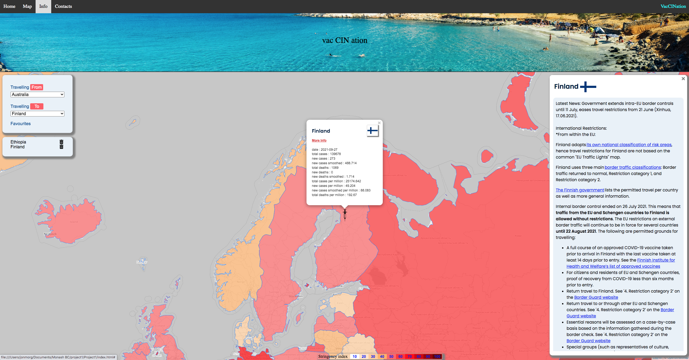

# vac CIN nation
First group project, tasked with using two apis, and local storage. could use any libraries. All css is custom, is designed to be responsive for smaller screens. 
The project idea came about by the desire to leave this city. just for a week. it is a travel website. covid smart travel website.
the source of the data for the api is https://ourworldindata.org/coronavirus.

https://jonmorg-hs.github.io/Project1/

