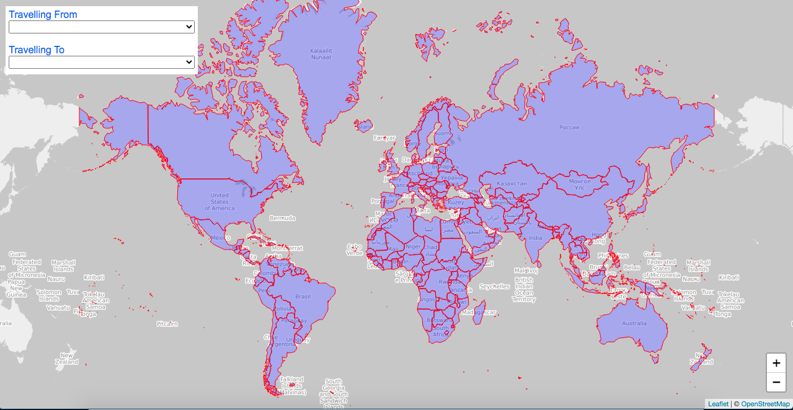
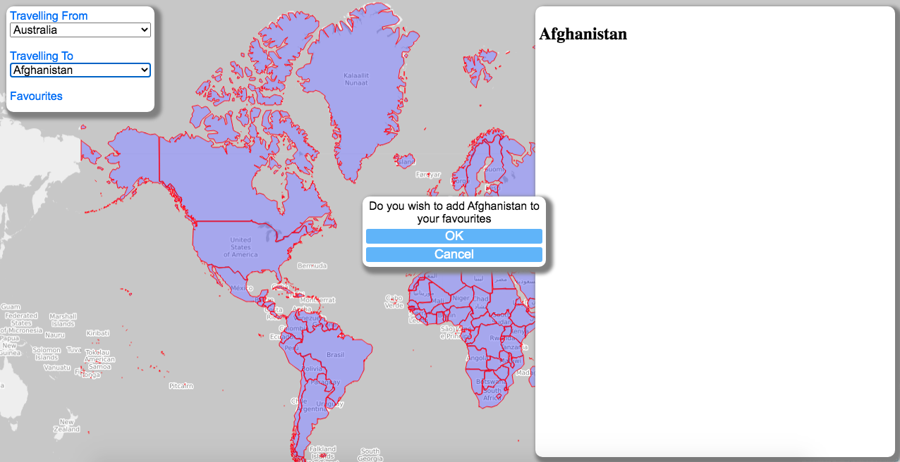

# Project1
vacCINation as a project name? Using the words vacation and vaccination, i thought about Vaccinacation/Vaccication, but found already being used. JabandGo was another thought but same, being used. Was thinking about CIN being Country I Need in vac-cin-ation

To get us up and running with the basic concept discussed, so we can bounce around some ideas and get tasks for each individual setup.

https://jonmorg-hs.github.io/Project1/

Using Jquery, leaflet.js, leaflet.css

geojson.xyz to get country polygons in geojson format

https://www.joinsherpa.com/api/request-access for the API that skyscanner are using

Currently can click on polygon to get country name.

Immediate Tasks:

1. populate the selection boxes with countries. We can do this be getting the country names when loading the country geojson. each geojson feature has attributes such as name.
2. decide on the travel restrictions API, and then get a response for country selected. Need to add a div to show the response.
3. Should be able to use same API on page load to get all the statistics and can color code the geojson polygons accordingly. Using same stats can present summary data.
4. Make country selection, save to favourites in local storage.

1 & 4. Done

