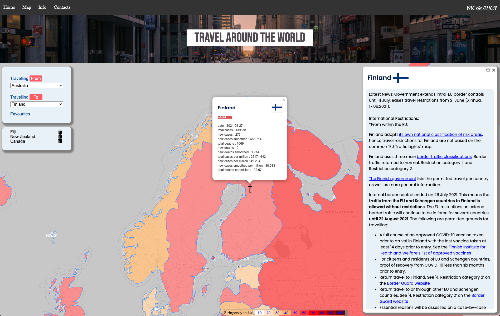

# VAC cin ATION

CIN - Country I Need - for a vacation in

<h2>Task</h2>

For the first group project, we were been tasked with using two APIs, local storage and any JS or CSS libraries (excl Bootstrap), to develop a webpage for any purpose.

<h2>Idea</h2>

The project idea came about by the desire to leave this city. just for a week. it is a travel website. a covid smart travel website.

<h2>UI</h2>

Using API data the User can quickly view on the map (via color coding) the currenty Stringency Index (0-100) for countries' management of the virus, whereby 0 means no restrictions, 100 means maximum restrictions.

The User can choose their travel origination country.

The User can then choose a destination country from either the list or clicking on the map, whereby the current Covid statistics are displayed with an option for more information.

When the User clicks More Info, the current travel restriction information is displayed. If the User's origination country is mentioned anywhere in the information, it will be highlighted.

The User can save the chosen country to their favourites for quick reference later.

 

<h2>Resources</h2>

We have implemented the js libraries: jQuery and Leaflet.js (incl Leaflet css) and fontawesome.

We have customised our own CSS, designed to be responsive for smaller screens.

We also implemented 3 apis:
The source of the current Covid data: https://ourworldindata.org/coronavirus
The source of current country travel information: https://data.humdata.org/dataset/covid-19-global-travel-restrictions-and-airline-information
The sooure of country flags: https://www.countryflags.io

<h2>Link</h2>

https://jonmorg-hs.github.io/Project1/
